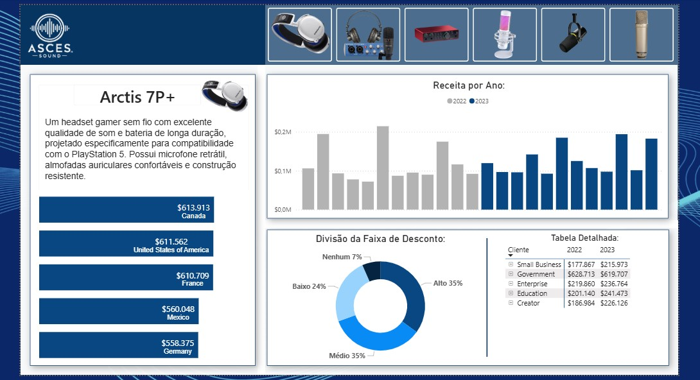

# Performance de Vendas - Produtos de Áudio

### Este projeto apresenta um **Dashboard de Análise de Vendas** desenvolvido no Power BI para uma empresa fictícia, com foco na visualização estratégica de receita, segmentação de clientes e análise de descontos.

###  O objetivo foi transformar dados brutos em insights visuais claros, facilitando a tomada de decisão baseada em dados.
---

---

## Objetivos:

- Comparar receita anual (2022 vs 2023)
- Identificar crescimento por segmento
- Analisar distribuição de faixas de desconto
- Apresentar dados detalhados por tipo de cliente
- Criar um dashboard visualmente profissional

---

## Principais Análises:

### Receita por Ano
Comparação da receita entre 2022 e 2023, evidenciando crescimento consistente em diversos segmentos.

---

### Segmentação por Tipo de Cliente:

Análise detalhada dos seguintes segmentos:

- Small Business
- Government
- Enterprise
- Education
- Creator

A tabela detalhada permite comparar o desempenho anual de cada segmento.

---

### Receita por País

Identificação dos principais mercados:

- 🇨🇦 Canadá
- 🇺🇸 Estados Unidos
- 🇫🇷 França
- 🇲🇽 México
- 🇩🇪 Alemanha

---

## Insights Estratégicos:

- Houve crescimento consistente entre 2022 e 2023.
- A maior parte das vendas envolve descontos médios e altos.
- Segmentos Enterprise e Government apresentam forte participação na receita.
- Mercados da América do Norte lideram o faturamento.

---